Example workflow / tutorial for the seegSDM package
========================================================

This document runs through a typical workflow for distribution modelling using the ```seegSDM``` package.

It will includes importing and checking data, running BRT ensembles in parallel, examining the fitted models and calculating and outputting prediciton rasters. Please report any issues via the [issues tracking system](https://github.com/SEEG-Oxford/seegSDM/issues).

### Contents

* [Installing the package](#install)
* [Loading data](#load)
* [Quality control](#quality)
* [Generating pseudo-absences](#pseudo)
* [Extracting covariate data](#extract)
* [Running a single BRT model](#BRT)
* [Running a BRT ensemble in parallel](#ensemble)
* [Summarizing the BRT ensemble](#vis)
* [Outputting the results](#output)


### <a id="install"></a>Installing the package

To install seegSDM straight from github we use the ```install_github``` function in the ```devtools``` package.

```r
# if it isn't already installed, install devtools from CRAN
# install.packages('devtools')

# and load it
library(devtools)

# use install_github to install seegSDM, giving the name of repo & owner
# and installing all the packages it depends on

# install_github('seegSDM', 'SEEG-Oxford', dependencies = 'Depends')

# seegSDM should now be installed, so we just need to load it
library(seegSDM)
```

```
## Warning: package 'dismo' was built under R version 3.0.2
```

```
## Warning: package 'raster' was built under R version 3.0.2
```


### <a id="load"></a>Loading data

Next we load in some occurrence data. Here we'll use fake occurrence data provided with the package, though you can import your own using e.g. ```read.csv```. The occurrence object has a number of different columns, giving coodinates of observations of a fake disease (both polygon and point data) as well as information needed for model fitting.


```r
# load the data
data(occurrence)

# look at the first 6 lines
head(occurrence)
```

```
##   UniqueID Admin Year Longitude Latitude Area
## 1        1  -999 1990     -6.15    -4.75   NA
## 2        2  -999 2013     -4.65     5.05   NA
## 3        3  -999 2009      2.65    -2.95   NA
## 4        4  -999 1992     -5.35     5.05   NA
## 5        5  -999 2008     -6.95    13.35   NA
## 6        6  -999 1999     -9.75     3.75   NA
```


Most of the ```seegSDM``` functions use ```SpatialPoints*``` objects (from the ```sp``` package) so we convert ```occurrence``` into one of these. We can do this using the function ```occurrence2SPDF``` which makes some assumptions about whats in ```occurrence``` (see the helpfile for details).


```r
# convert to a SpatialPoints object
occ <- occurrence2SPDF(occurrence)
```


Next we load a bunch of raster files containing covariates for the model. Again, we use some fake data rasters which are provided with the package. You can import your own using ```raster``` from the ```raster``` package or maybe using the ````seegSDM``` function ```importRasters``` to make things a little easier.


```r
# load the covariate rasters
data(covariates)

# see a summary
covariates
```

```
## class       : RasterBrick 
## dimensions  : 200, 200, 40000, 3  (nrow, ncol, ncell, nlayers)
## resolution  : 0.1, 0.1  (x, y)
## extent      : -10, 10, -5, 15  (xmin, xmax, ymin, ymax)
## coord. ref. : +init=epsg:3395 
## data source : in memory
## names       :   cov_a,   cov_b,   cov_c 
## min values  : -1.2989, -0.6801,  1.0000 
## max values  : -0.2735,  0.6020,  6.0000
```

```r

# and plot them
plot(covariates)
```

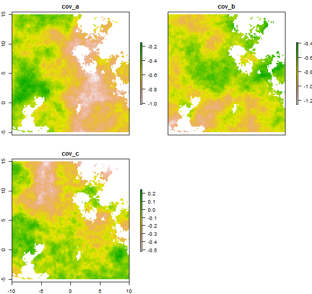 


### <a id="quality"></a>Quality control

There are currently two functions to check the quality of incoming data: ```checkRasters``` which checks that rasters match up with an expected template raster and ```checkOccurrence``` which runs a number of checks on the incoming occurrence data to make sure there aren't any serious errors, and to tidy up some more minor ones.

First we'll run ```checkRasters``` to make sure the ```covariates``` lines up with a template raster that we know is correct.


```r
# load a template raster to check covariates against
data(template)

# run checkRasters
checkRasters(covariates, template)
```

```
## class       : RasterBrick 
## dimensions  : 200, 200, 40000, 3  (nrow, ncol, ncell, nlayers)
## resolution  : 0.1, 0.1  (x, y)
## extent      : -10, 10, -5, 15  (xmin, xmax, ymin, ymax)
## coord. ref. : +init=epsg:3395 
## data source : in memory
## names       :   cov_a,   cov_b,   cov_c 
## min values  : -1.2989, -0.6801,  1.0000 
## max values  : -0.2735,  0.6020,  6.0000
```


If everything is fine the original object is returned (so here R prints a summary), otherwise an error is thrown. See ```?checkRasters``` for more details of the checks that are done.

Next we use ```checkOccurrence``` run a whole bunch of checks (```?checkOccurrence``` for details) on the incoming occurrence data. We need a few other raster layers to do this, including an evidence consensus layer and a raster brick of admin unit maps (again, these are fake data).

We load and plot the evidence consensus layer:

```r
data(consensus)
plot(consensus)
```

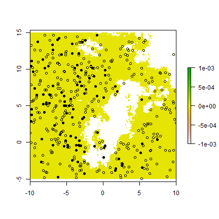 


and a raster brick with (fake) GAUL codes at 4 different levels.

```r
# load and plot the four layers
data(admin)
plot(admin)
```

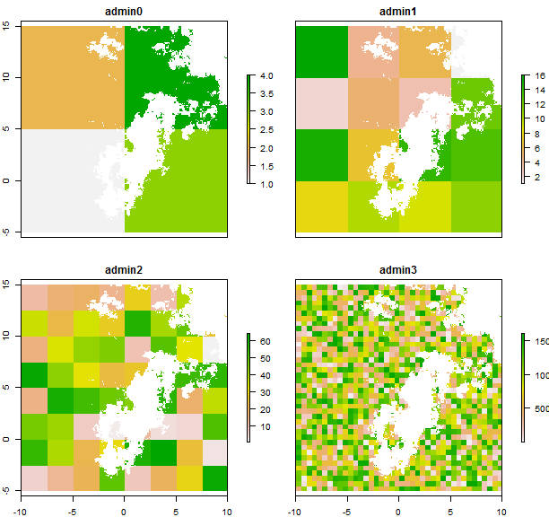 


Now we can run ```checkOccurrence```

```r
# overwriting the occ object we defined before
occ <- checkOccurrence(occurrence, consensus, admin)
```

```
## 25 polygons had areas greater than the area threshold of 1 and will be removed.
```


some of the occurrence points were in polygons with areas geater than the default allowed maximum. The maximum allowed area can be altered. Other than this all of the checks were passed. If any major problems had been detected, ```checkOccurrence``` would have thrown an error message.

### <a id="pseudo"></a>Generating pseudo-absences & extracting the data

There are various different schools of thought on how to select pseudo-absences for presence-only species distribution modelling.

The recent Dengue distribution paper by [Bhatt et al.](http://dx.doi.org/10.1038/nature12060) used a distance threshold and an evidence consensus layer to select both pseudo-absence and pseudo-presence points. The function ```extractBhatt``` takes a vector of three required parameters and applies this procedure. It also extracts the values of the covariates for all of these points. For polygon occurrence records the multiple values are efficiently extracted and summarised using the function ```extractAdmin```. For point data the ```raster``` package function ```extract``` is used.

Other pseduo-data generation methods can be carried out using the more general functions ```bgSample``` and ```bgDistance```. Here we apply ```extractBhatt``` to our data using some arbitrary parameter settings.


```r
# to make sure this tutorial is reproducible, we set the seed for the
# random number generator
set.seed(1)

# run extractBhatt, defining the last covariate as a factor
lis <- extractBhatt(c(2, 1, 5), occ, covariates, consensus, admin, factor = c(FALSE, 
    FALSE, TRUE), return_points = TRUE)
```


With ```return_points = TRUE```, ```extractBhatt``` produces a list with three elements: a dataframe for modelling and the locations of the pseudo-presence and pseudo-absence records. We have a look at the object and plot the points.


```r
# look what's in the list returned
names(lis)
```

```
## [1] "data"            "pseudo_absence"  "pseudo_presence"
```

```r

# summarise the dataframe which we'll use for modelling
summary(lis$data)
```

```
##        PA        Longitude         Latitude         cov_a       
##  Min.   :0.0   Min.   :-9.950   Min.   :-4.85   Min.   :-1.265  
##  1st Qu.:0.0   1st Qu.:-4.950   1st Qu.:-0.45   1st Qu.:-0.859  
##  Median :0.5   Median :-0.850   Median : 4.10   Median :-0.708  
##  Mean   :0.5   Mean   :-0.451   Mean   : 4.87   Mean   :-0.739  
##  3rd Qu.:1.0   3rd Qu.: 4.550   3rd Qu.:10.18   3rd Qu.:-0.592  
##  Max.   :1.0   Max.   : 9.950   Max.   :14.85   Max.   :-0.361  
##      cov_b        cov_c  
##  Min.   :-0.583   1:  3  
##  1st Qu.:-0.305   2: 70  
##  Median :-0.149   3:102  
##  Mean   :-0.126   4: 93  
##  3rd Qu.: 0.026   5: 30  
##  Max.   : 0.457   6:  2
```

```r

# evidence consensus layer as a background
plot(consensus)

# add the pseudo-absences in light blue (note they aren't in high scoring
# consensus regions)
points(lis$pseudo_absence, pch = 16, col = "light blue")

# and pseudo-presences in purple (not in the very low scoring regions)
points(lis$pseudo_presence, pch = 16, col = "purple")

# and add the occurrence points
points(occ, pch = 16)
```

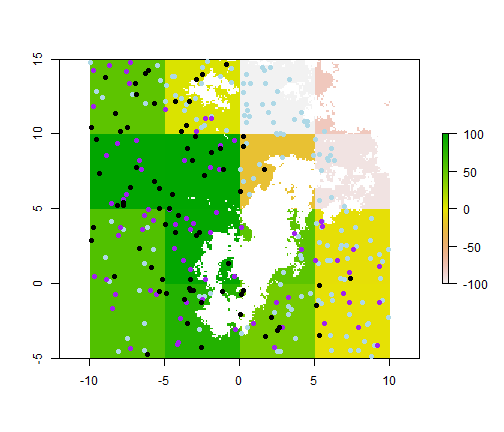 


### <a id="BRT"></a>Running a single BRT model 

We're now ready to run a BRT model. The ```gbm.step``` function in the ```dismo``` package (which ```seegSDM``` loads) runs a cross-validation procedure to pick the best number of trees (an important parameter in BRT) and runs the final model. ```seegSDM``` provides a wrapper function ```runBRT``` for ```gbm.step``` with a set of SEEG-preferred default settings. Only four arguments need to be provided: the dataframe, the indicies for the presence/pseudo-absence and covariate columns and a ```RasterBrick``` object to predict to.


```r
brt <- runBRT(lis$data, 4:6, 1, covariates, gbm.coords = 2:3)
```

```
## 
##  
##  GBM STEP - version 2.9 
##  
## Performing cross-validation optimisation of a boosted regression tree model 
## for PA with dataframe data and using a family of bernoulli 
## Using 300 observations and 3 predictors 
## creating 10 initial models of 10 trees 
## 
##  folds are stratified by prevalence 
## total mean deviance =  1.386 
## tolerance is fixed at  0.0014 
## now adding trees... 
## fitting final gbm model with a fixed number of  430  trees for  PA
```


```runBRT``` returns a list giving the model, a raster of the predicted probability of presence and data to plot the relative influence and covariate effects. The last two are used in the BRT ensemble modelling, but we can visualise the single model using functions from the ```gbm``` package.

We can plot the individual marginal effect curves for each covariate...


```r
par(mfrow = c(1, nlayers(covariates)))
for (i in 1:nlayers(covariates)) {
    plot(brt$model, i)
}
```

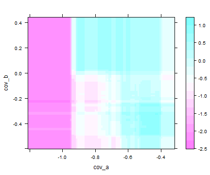 


...the 2-dimensional interaction between the first two covariates...

```r
plot(brt$model, 1:2)
```

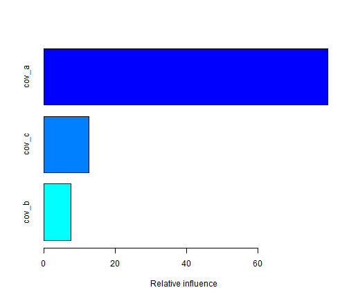 


...the relative influence of each covariate...

```r
summary(brt$model)
```

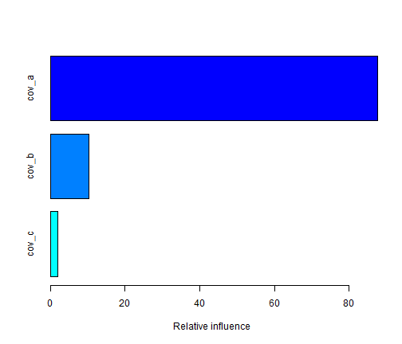 

```
##         var rel.inf
## cov_a cov_a  87.688
## cov_b cov_b  10.255
## cov_c cov_c   2.057
```


... (internal) cross-validation statistics...

```r
getStats(brt)
```

```
## deviance     rmse    kappa      auc     sens     spec      pcc kappa_sd 
## 28.26434  0.46145  0.42879  0.73194  0.59823  0.83056  0.71439  0.17069 
##   auc_sd  sens_sd  spec_sd   pcc_sd   thresh 
##  0.11250  0.13925  0.09125  0.09460  0.59824
```


...and the map of predicted habitat suitability produced by ```runBRT```.

```r
plot(brt$pred, zlim = c(0, 1))
```

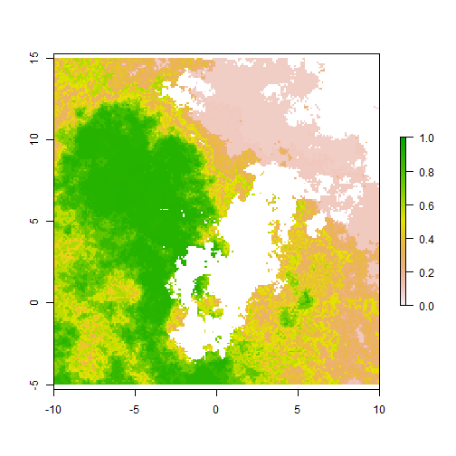 


### <a id="ensemble"></a>Running a BRT ensemble in parallel

The plots above show one of the drawbacks of single BRT models: they fit very jerky effects of environmental covariates. We can get smoother and more realistic effect curves through fitting and averaging an ensemble of multiple BRT models. Ensembling also allows us to reduce reliance of the model on the arbitrary selection of parameters for pseudo-data generation and enables us to produce estimates of uncertainty in both the model and its predictions.

Next we'll set up an ensemble of models fitted using pseudo-data generated in different ways by altering the parameters passed to ```extractBhatt```. We first define the ranges of parameters to use then get all the different combinations using R's ```expand.grid``` function.


```r
# pseudo-absences per occurrence:
na <- c(1, 5, 10)
# pseudo-presences per occurrence:
np <- c(0.1, 0.05, 0.01)
# distance (in decimal degrees) within which to sample these
mu <- c(1, 3, 5)

pars <- expand.grid(na = na, np = np, mu = mu)

# each row contains a different configuration of parameters
head(pars)
```

```
##   na   np mu
## 1  1 0.10  1
## 2  5 0.10  1
## 3 10 0.10  1
## 4  1 0.05  1
## 5  5 0.05  1
## 6 10 0.05  1
```

```r

# now there are 3 * 3 * 3 = 27 different combinations and models to run
nrow(pars)
```

```
## [1] 27
```


To use all of the ```seegSDM``` functions for running ensembles we need to change these into a list, which we can do using ```lapply``` and a small function to subset ```pars```.


```r
sub <- function(i, pars) {
    pars[i, ]
}
par_list <- lapply(1:nrow(pars), sub, pars)
```


Unfortunately running BRT ensembles can be time consuming and it's preferable to run them in parallel across multiple processors. There are a number of different R packages to help with this, but here we use the ```snowfall``` package.

Loading seegSDM has already loaded snowfall, so the first thing we need to do is set up a parallel cluster using the function ```sfInit```, which is as easy as this:


```r
# set up a cluster of four cpus in with parallel execution.  You may want
# to run a different number depending on your computer!
sfInit(cpus = 4, parallel = TRUE)
```

```
## R Version:  R version 3.0.1 (2013-05-16)
```

```
## snowfall 1.84-4 initialized (using snow 0.3-12): parallel execution on 4
## CPUs.
```


We need to export any functions we want to run in parallel out to each processor. Everything we'll use is in ```seegSDM```, so we export the whole package using ```sfLibrary```


```r
sfLibrary(seegSDM)
```

```
## Library seegSDM loaded.
```

```
## Library seegSDM loaded in cluster.
```


Now we're ready to run some code in parallel. We use the function ```sfLapply``` which acts like ```lapply```, except that each element of the list is processed in parallel. We run ```extractBhatt``` over these different parameter settings.


```r
# carry out data extraction for the ensemble in parallel takes around 9s
# on my 4-core machine
data_list <- sfLapply(par_list, extractBhatt, occ, covariates, consensus, admin, 
    factor = c(FALSE, FALSE, TRUE))
```


`data_list` is a list with each element containing a different dataframe for modelling. We run the BRT ensemble by using `sfLapply` again, this time with `runBRT`.


```r
# fit the models of the ensemble in parallel takes around 45s on my 4-core
# machine
model_list <- sfLapply(data_list, runBRT, 4:6, 1, covariates, gbm.coords = 2:3)
```


```model_lis``` now contains a list the objects returned by each ```runBRT``` run. We can get cross-validation statistics for each of these using ```getStats```. We do that now, also in parallel, then combine them into a single matrix.


```r

# get cv statistics in parallel
stat_lis <- sfLapply(model_list, getStats)

# Now we've finished with the parallel cluster, we should shut it down
sfStop()
```

```
## Stopping cluster
```

```r

# convert the list into a matrix using apply with the do.call function
stats <- do.call("rbind", stat_lis)

# look at it
head(stats)
```

```
##      deviance   rmse  kappa    auc   sens   spec    pcc kappa_sd auc_sd
## [1,]    18.52 0.4707 0.4964 0.6978 0.5946 0.9018 0.7482   0.1905 0.1490
## [2,]    29.03 0.5540 0.3778 0.6933 0.6486 0.7292 0.6889   0.1902 0.1277
## [3,]    34.27 0.5722 0.4708 0.7268 0.6014 0.8694 0.7354   0.1703 0.1286
## [4,]    19.86 0.4884 0.3625 0.6303 0.6857 0.6768 0.6813   0.2101 0.1547
## [5,]    27.58 0.5448 0.4071 0.6285 0.5821 0.8250 0.7036   0.1861 0.1522
## [6,]    34.28 0.5955 0.4429 0.7121 0.6589 0.7839 0.7214   0.2122 0.1415
##      sens_sd spec_sd pcc_sd  thresh
## [1,]  0.1528 0.05115 0.1155 0.61955
## [2,]  0.1379 0.11821 0.1123 0.18061
## [3,]  0.1352 0.07853 0.1068 0.18054
## [4,]  0.1513 0.13889 0.1242 0.51516
## [5,]  0.1581 0.06890 0.1170 0.24322
## [6,]  0.1701 0.12780 0.1154 0.09449
```

```r

# and produce a boxplot of a few imnportant statistics
boxplot(stats[, 3:7], col = "grey", ylim = c(0, 1))
```

 


We now have a list of model outputs, each of which contains the fitted model, predictions and information for plotting. We can pull out individual model runs and plot the predictions.


```r
par(mfrow = c(1, 2))
plot(model_list[[1]]$pred, main = "run 1", zlim = c(0, 1))
plot(model_list[[27]]$pred, main = "run 27", zlim = c(0, 1))
```

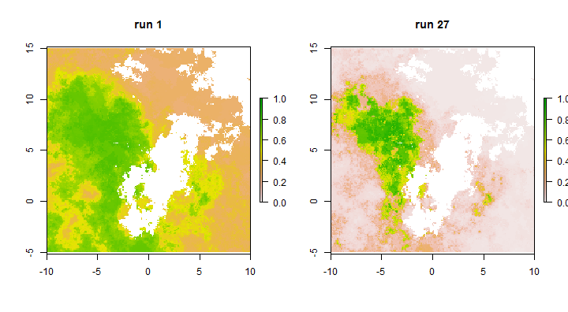 


### <a id="vis"></a>Summarizing the BRT ensemble

There are three helper functions to help us summarize the BRT ensemble: `getRelInf`, `getEffectPlots` and `combinePreds`. `getRelInf` combines the models to get summaries of the relative influence of the covariates across all the models. It returns a matrix of means and quantiles, and optionally produces a boxplot.


```r
relinf <- getRelInf(model_list, plot = TRUE)
```

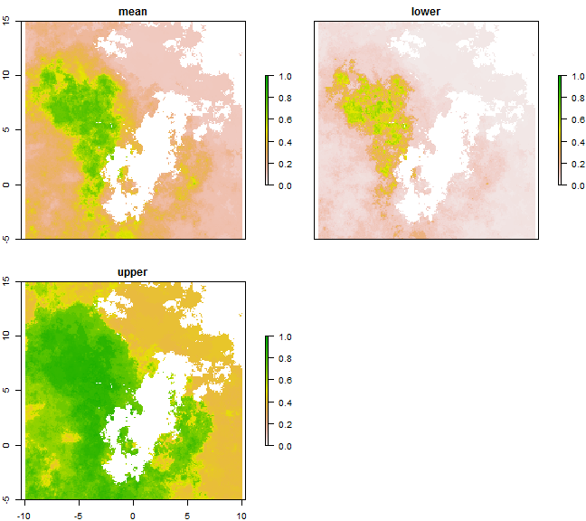 

```r
relinf
```

```
##         mean   2.5% 97.5%
## cov_a 67.635 57.999 78.47
## cov_b 26.460 18.314 35.61
## cov_c  5.904  1.722 14.69
```


`getEffectPlots` performs a similar operation for the effect plots, optionally plotting mean effects with uncertainty intervals.


```r
par(mfrow = c(1, 3))
effect <- getEffectPlots(model_list, plot = TRUE)
```

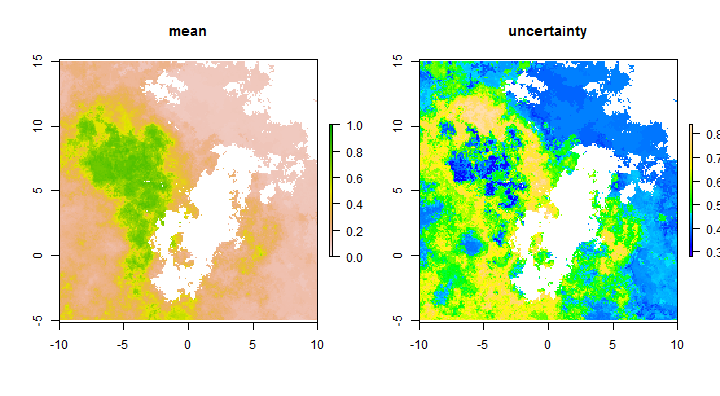 


`combinePreds` combines the prediction maps (on the probability scale) from multiple models and returns rasters giving the mean, median and quantiles of the ensemble predictions. unlike the previous two functions, `combinePreds` needs a `RasterBrick` or `RasterStack` object with each layers giving a single prediction. So we need to create one of these before we can use `combinePreds`. Note that we can also run `combinePreds` in parallel to save some time if the rasters are particularly large.


```r
# lapply to extract the predictions into a list
preds <- lapply(model_list, function(x) x$pred)
# coerce the list into a rasterbrick
preds <- brick(preds)

# now we can run combinePreds
preds <- combinePreds(preds)

# plot the resulting maps
plot(preds, zlim = c(0, 1))
```

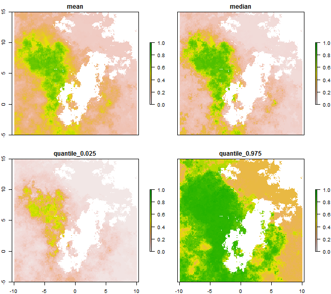 


We can create a simple map of prediction uncertainty by subtracting the lower from the upper quantile.


```r
# calculate uncertainty
preds$uncertainty <- preds[[4]] - preds[[3]]

# plot mean and uncertainty
par(mfrow = c(1, 2))

# plot mean
plot(preds$mean, zlim = c(0, 1), main = "mean")

# and uncertainty
plot(preds$uncertainty, col = topo.colors(100), main = "uncertainty")
```

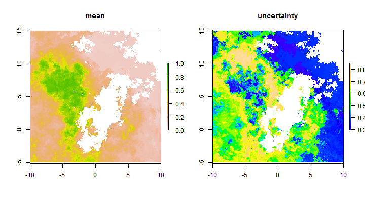 


### <a id="output"></a>Outputting the results

Outputting the prediction maps can be done with the function `writeRaster` in the `raster` package. See `?writeFormats` for the raster formats that can be written to, and how to specify them.


```r
# write the mean prediction and uncertainty rasters as Geo-Tiffs
writeRaster(preds$mean, "c:/prediction_map", format = "GTiff")
writeRaster(preds$uncertainty, "c:/uncertainty_map", format = "GTiff")
```


