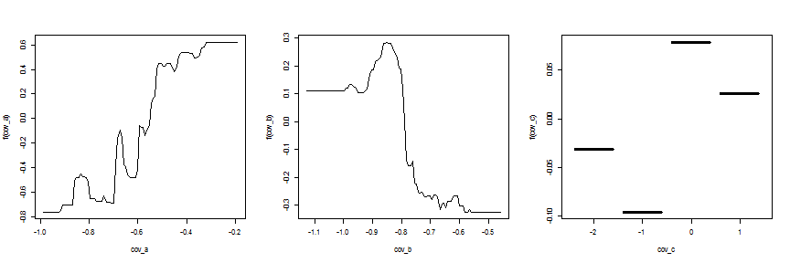

Example workflow / tutorial for the seegSDM package
========================================================

This document runs through a typical workflow for distribution modelling using the ```seegSDM``` package.

It will include importing and checking data, running BRT ensembles in parallel and examining the fitted models.
This is a work in progress, so sorry if it stops halfway through or doesn't make any sense yet! Please report any issues via the [issues tracking system](https://github.com/SEEG-Oxford/seegSDM/issues).

The structure is:

##### [Installing the package](#install)
##### [Loading data](#load)
##### [Quality control](#quality)
##### [Generating pseudo-absences](#pseudo)
##### [Extracting covariate data](#extract)
##### [Running a single BRT model](#BRT)
##### [Running a BRT ensemble in parallel](#ensemble)
##### [Visualising the BRT ensemble](#vis)
##### [Outputting the results](#output)


### <a id="install"></a>Installing the package

To install seegSDM straight from github we use the ```install_github``` function in the ```devtools``` package.

```r
# if it isn't already installed, install devtools from CRAN
# install.packages('devtools')

# and load it
library(devtools)

# use install_github to install seegSDM, giving the name of repo & owner
# and installing all the packages it depends on

# install_github('seegSDM', 'SEEG-Oxford', dependencies = 'Depends')

# seegSDM should now be installed, so we just need to load it
library(seegSDM)
```


### <a id="load"></a>Loading data

Next we load in some occurrence data. Here we'll use fake occurrence data provided with the package, though you can import your own using e.g. ```read.csv```. The occurrence object has only two columns, giving the latitudes and longitudes of observations of the fake disease. 

```r
# load the data
data(occurrence)

# look at the first 6 lines
head(occurrence)
```

```
##   UniqueID Admin     x     y Area
## 1        1 -9999 -6.15 -4.75   NA
## 2        2 -9999 -4.65  5.05   NA
## 3        3 -9999  2.65 -2.95   NA
## 4        4 -9999 -5.35  5.05   NA
## 5        5 -9999 -6.95 13.35   NA
## 6        6 -9999 -9.75  3.75   NA
```


Most of the ```seegSDM``` functions use ```SpatialPoints*``` objects (from the ```sp``` package) so we convert ```occurrence``` into one of these. We can do this using the function ```occurrence2SPDF``` which makes some assumptions about whats in ```occurrence```, see the helpfile for details.


```r
# convert to a SpatialPoints object
occ <- occurrence2SPDF(occurrence)
```


Next we load a bunch of raster files containing covariates for the model. Again, we use some fake data rasters which are provided with the package. You can import your own using ```raster``` from the ```raster``` package or maybe using the ````seegSDM``` function ```importRasters``` to make things a little easier.


```r
# load the covariate rasters
data(covariates)

# see a summary
covariates
```

```
## class       : RasterBrick 
## dimensions  : 200, 200, 40000, 3  (nrow, ncol, ncell, nlayers)
## resolution  : 0.1, 0.1  (x, y)
## extent      : -10, 10, -5, 15  (xmin, xmax, ymin, ymax)
## coord. ref. : +init=epsg:3395 
## data source : in memory
## names       :   cov_a,   cov_b,   cov_c 
## min values  : -1.2989, -0.6801,  1.0000 
## max values  : -0.2735,  0.6020,  6.0000
```

```r

# and plot them
plot(covariates)
```

 


### <a id="quality"></a>Quality control

There are currently two functions to check the quality of incoming data: ```checkRasters``` which checks that rasters match up with an expected template raster and ```checkOccurrences``` which checks that all data fields are present and that no datapoints folled into masked out areas on template raster. Here we only look at ```checkRasters```, since the templates for ```checkOccurrences``` are yet to be determined!


```r
# first we load a template raster to check covariates against
data(template)

# then we run checkRasters
checkRasters(covariates, template)
```

```
## class       : RasterBrick 
## dimensions  : 200, 200, 40000, 3  (nrow, ncol, ncell, nlayers)
## resolution  : 0.1, 0.1  (x, y)
## extent      : -10, 10, -5, 15  (xmin, xmax, ymin, ymax)
## coord. ref. : +init=epsg:3395 
## data source : in memory
## names       :   cov_a,   cov_b,   cov_c 
## min values  : -1.2989, -0.6801,  1.0000 
## max values  : -0.2735,  0.6020,  6.0000
```


If everything is fine the original object is returned (so here R prints a summary), otherwise an error is thrown. See ```?checkRasters``` for more details of the checks that are done.

### <a id="pseudo"></a>Generating pseudo-absences

There are various different schools of thought on how to select pseudo-absences for presence-only species distribution modelling. Currently SEEG projects are using a distance threshold biased by evidence consensus.
Given a set of occurrence points and a raster image, we can do this using ```bgDistance```, which uses the more generic pseudo-absence generation function ```bgSample```.


```r
# to make sure this tutorial is reproducible, we set the seed for the
# random number generator
set.seed(1)

# sample 300 pseudo-absence points from within 500km of the occurrence
# points
pseudo <- bgDistance(300, points = occ, raster = template, distance = 5e+05)

# plot the template raster
plot(template)

# the pseudo-absences as hollow circles
plot(pseudo, add = TRUE, pch = 1)

# and the occurrence points as filled circles
plot(occ, add = T, pch = 16)
```

 


If you use an evidence consensus raster instead of the template (probably with some transformation of the values), you can bias the sampling according to this by setting ```prob=TRUE``` in ```bgDistance``` (this will then be passed on to ```bgSample```) we don't have an example of that (yet) so the points will do for now.

### <a id="extract"></a>Extracting covariate data 

Now we have all the covariate rasters, occurrence and pseudo-absence points we are almost ready to run a model.
First though we need to extract the covariate data for both sets of points


```r
# extract covariates for occurrence points
occ_covs <- extract(covariates, occ)

# and pseudo-absence points
pseudo_covs <- extract(covariates, pseudo)
```


Then we need to combine them into single dataframe, making sure we add a label saying whether they are occurrence or pseudo-absence records


```r
# add a column of 1s to the occurrence covariates
occ_data <- cbind(PA = rep(1, nrow(occ_covs)), occ_covs)

# and a column of 0s to the pseudo-absence covariates
pseudo_data <- cbind(PA = rep(0, nrow(pseudo_covs)), pseudo_covs)

# then we combine the matrices together
all_data <- rbind(occ_data, pseudo_data)
```


The covariate data and presence/pseudo-absence labels are now all in a single matrix. Before we fit a model we turn this into a dataframe. Unlike matrices, dataframes allow us to identify covariates as categorical variables. ```cov_c``` should be categorical, so we define it as such here so this is an opportunity to define them as such using ```factor```.


```r
# coerce it into a dataframe
all_data <- as.data.frame(all_data)

# coerce cov_c to a factor
all_data$cov_c <- factor(all_data$cov_c)

# look at the first 6 records
head(all_data)
```

```
##   PA   cov_a   cov_b cov_c
## 1  1 -0.5557 -0.4272     5
## 2  1 -0.3608 -0.2602     4
## 3  1 -0.6765 -0.3166     4
## 4  1 -0.5165 -0.2662     4
## 5  1 -0.7829  0.1392     2
## 6  1 -0.7377 -0.4456     3
```

```r

# summarize the dataframe (the previous checks should mean that there
# aren't any NA values)
summary(all_data)
```

```
##        PA           cov_a            cov_b         cov_c  
##  Min.   :0.00   Min.   :-1.208   Min.   :-0.5989   1:  1  
##  1st Qu.:0.00   1st Qu.:-0.785   1st Qu.:-0.3462   2: 71  
##  Median :0.00   Median :-0.660   Median :-0.2004   3:140  
##  Mean   :0.25   Mean   :-0.688   Mean   :-0.1716   4:141  
##  3rd Qu.:0.25   3rd Qu.:-0.538   3rd Qu.:-0.0293   5: 45  
##  Max.   :1.00   Max.   :-0.323   Max.   : 0.4388   6:  2
```


### <a id="BRT"></a>Running a single BRT model 

We're now ready to run a BRT model. The ```gbm.step``` function in the ```dismo``` package (which ```seegSDM``` loads) runs a cross-validation procedure to pick the best number of trees (an important parameter in BRT) and runs the final model. ```seegSDM``` provides a wrapper function ```runBRT``` for ```gbm.step``` with a set of SEEG-preferred default settings. Only four arguments need to be provided: the dataframe, the indicies for the presence/pseudo-absence and covariate columns and a ```RasterBrick``` object to predict to.


```r
brt <- runBRT(all_data, 2:4, 1, covariates)
```

```
## 
##  
##  GBM STEP - version 2.9 
##  
## Performing cross-validation optimisation of a boosted regression tree model 
## for PA with dataframe data and using a family of bernoulli 
## Using 400 observations and 3 predictors 
## creating 10 initial models of 10 trees 
## 
##  folds are stratified by prevalence 
## total mean deviance =  0.6931 
## tolerance is fixed at  7e-04 
## now adding trees... 
## fitting final gbm model with a fixed number of  400  trees for  PA
```


```runBRT``` returns a list giving the model, a raster of the predicted probability of presence and data to plot the relative influence and covariate effects. The last two are used in the BRT ensemble modelling, but we can visualise the single model using functions from the ```gbm``` package.

We can plot the individual marginal effect curves for each covariate...


```r
par(mfrow = c(1, nlayers(covariates)))
for (i in 1:nlayers(covariates)) plot(brt$model, i)
```

 


...the 2-dimensional interaction between the first two covariates...

```r

plot(brt$model, 1:2)
```

 


...the relative influence of each covariate...

```r
summary(brt$model)
```

 

```
##         var rel.inf
## cov_a cov_a  64.211
## cov_b cov_b  31.267
## cov_c cov_c   4.522
```


...and the map of predicted habitat suitability produced by ```runBRT```.

```r
plot(brt$pred, zlim = c(0, 1))
```

 


### <a id="ensemble"></a>Running a BRT ensemble in parallel


### <a id="vis"></a>Visualising the BRT ensemble


### <a id="output"></a>Outputting the results


